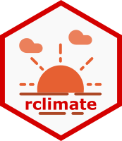

# climatrends

<!-- badges: start -->
[](https://cran.r-project.org/package=climatrends)
[](https://cran.r-project.org/web/checks/check_results_climatrends.html)
[](https://cran.r-project.org/package=climatrends)
[](https://travis-ci.org/agrobioinfoservices/climatrends)
[](https://codecov.io/github/agrobioinfoservices/climatrends?branch=master)
[](https://www.repostatus.org/#active)
[](https://www.tidyverse.org/lifecycle/#maturing)
<!-- badges: end -->

# *climatrends*: Precipitation and temperature indices for climate variability analysis 

## Overview

The **climatrends** package provides methods to compute precipitation and temperature indices for climate models in ecology. The indices produced here can be used as explanatory variables for crop modelling, trends in climate change and to assess the interactions of plants and animals with the environment.

## Package website

<https://agrobioinfoservices.github.io/climatrends/>

## Installation

The package may be installed from CRAN via

``` r
install.packages("climatrends")
```

The development version can be installed via

``` r
library("remotes")
install_github("agrobioinfoservices/climatrends", build_vignettes = TRUE)
```

## Example

The default method for the function `temperature()` has as the basic input an `object` of class `data.frame` (or any other that can be coerced to a data.frame) with the longitude and latitude in geographic coordinates and a vector of class `Date` for the first day that will be taken into account for the indices. The duration from where the temperature indices will be computed is defined by the argument `span` which can be a single integer that takes into account a single timespan for all points or a vector indicating the timespan for each point.

Here we generate some random points within the Innlandet county in Norway from May-2015:


```r
set.seed(6)
lonlat <- data.frame(lon = runif(5, 8.3, 12),
                     lat = runif(5, 60, 62.3))

date <- as.Date("2015-05-01", format = "%Y-%m-%d")

temp <- temperature(lonlat, day.one = date, span = 50)

temp

  maxDT minDT maxNT  minNT   DTR    SU    TR   CFD
  <dbl> <dbl> <dbl>  <dbl> <dbl> <dbl> <dbl> <dbl>
1 12.81 -0.58  3.61 -10.84  7.36  0.00  0.00 13.00
2 13.39  0.66  3.84  -7.60  7.02  0.00  0.00 12.00
3 10.68 -1.48  2.43 -11.29  7.12  0.00  0.00 40.00
4 14.08  1.53  3.94  -6.85  8.44  0.00  0.00 12.00
5 19.64  5.82  8.24  -2.40  8.23  0.00  0.00  1.00

```

The indices can be splitted for timeseries analysis with intervals. Here we get the temperature indices for the same area with intervals of 7 days after `day.one`.

```r
temp <- temperature(lonlat, day.one = date, span = 50, 
                    timeseries = TRUE, 
                    intervals = 7)

temp

       id       date index  value
    <int>     <date> <chr>  <dbl>
1       1 2015-05-01 maxDT   9.70
2       1 2015-05-01 minDT  -0.58
3       1 2015-05-01 maxNT   2.42
4       1 2015-05-01 minNT -10.84
5       1 2015-05-01   DTR   8.19
---                              
276     5 2015-06-12 minNT   3.25
277     5 2015-06-12   DTR   9.00
278     5 2015-06-12    SU   0.00
279     5 2015-06-12    TR   0.00
280     5 2015-06-12   CFD   0.00
       
```


## Going further

The full functionality of **climatrends** is illustrated in the package vignette. The vignette can be found on the [package website](https://agrobioinfoservices.github.io/climatrends/) or from within `R` once the package has been installed, e.g. via

``` r
vignette("Overview", package = "climatrends")
```

## Meta

  - Package [website](https://agrobioinfoservices.github.io/climatrends/)
  
  - Please [report any issues or bugs](https://github.com/agrobioinfoservices/climatrends/issues).

  - License: [MIT](https://opensource.org/licenses/MIT)

  - Get citation information for *climatrends* in R by typing `citation(package = "climatrends")`.

  - You are welcome to contribute to the *climatrends* project. Please read our [contribution guide lines](CONTRIBUTING.md).

  - Please note that the *climatrends* project is released with a [Contributor Code of Conduct](CODE_OF_CONDUCT.md). By participating in the *climatrends* project you agree to abide by its terms.
