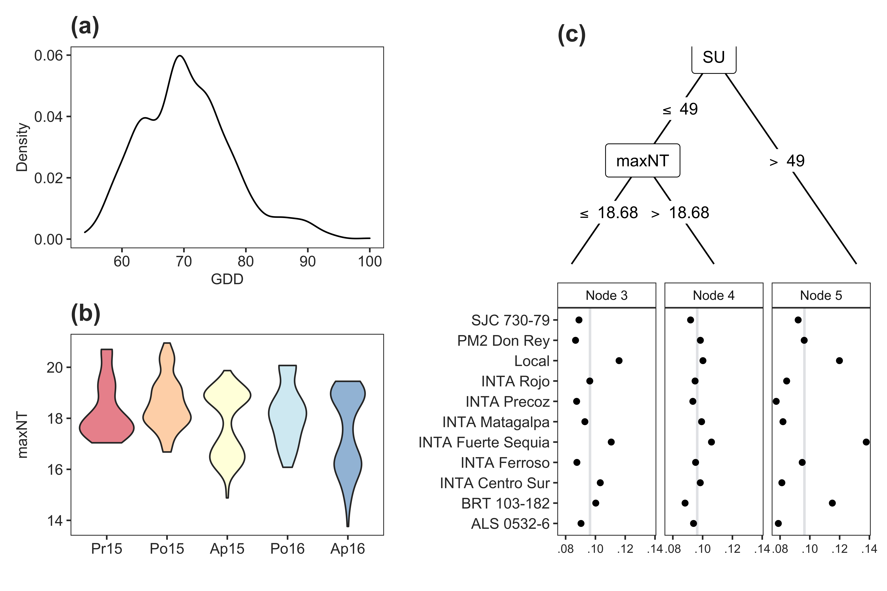

```{r get data, include=FALSE}
library("knitr")
library("kableExtra")
library("tidyverse")
library("climatrends")
library("PlackettLuce")
load("cbean.rda")
```


>Kauê de Sousa^1,2[*]^, Magne Neby^3^, Jacob van Etten^2^, Svein Øivind Solberg^1^  
^1^ Department of Agricultural Sciences, Inland Norway University of Applied Sciences, 2318 Hamar, Norway  
^2^ Bioversity International, 00054 Maccarese, Rome, Italy  
^3^ Department of Forest and Field Sciences, Inland Norway University of Applied Sciences, 2480 Koppang, Norway    
^[*]^ Correspondence should be addressed to: <kaue.desousa@inn.no>

\

# Introduction

Abiotic factors play an important role in most ecological and crop systems that depend on certain levels of temperature, light and precipitation (and their interplay) to initiate important physiological events [@PlantEcology]. In the walk of climate change, understanding how these factors drive the physiological processes is a key approach to provide recommendations for adaptation and biodiversity conservation.

[...continue...]

`climatrends` aims to provide the R [@RCoreTeam] toolkit to compute extreme precipitation and temperature indices that serve as input for climate and crop models [@vanEtten2019; @Kehel2016], trends in climate change [@Aguilar2005; @deSousa2018] and applied ecology [@Prentice1992; @YLiu2018].

[...continue...]

# Methods and features

## Implementation

Six main functions are provided, `crop_sensitive()`, `ETo()`, `GDD()`, `late_frost()`, `rainfall()` and `temperature()` with a default method for numeric 'vector' and additional methods implemented via the package `methods` [@RCoreTeam] for classes 'matrix' (or array), 'data.frame', and 'sf' (of geometry POINT or POLYGON) [@sf]. The last two methods are designed to fetch data from cloud sources. 

[...continue...]

say that the idea for the functions started with citizen science projects that is why `day.one` and `span` may be variable across locations. For time series analysis where fixed periods are defined across many locations the indices can be adjusted with last.day. 

[...continue...]


## Temperature and precipitation indices

The indices computed by the functions `temperature()` and `rainfall()` are described in Table 2.

## Growing degree-days

Growing degree-days (gdd) is an heuristic tool in phenology that measures heat accumulation and is used to predict plant and animal development rates [@Prentice1992]. Growing degree-days are calculated by taking the integral of warmth above a base temperature ($T_{0}$). The function `GDD()` applies by default the following equation.

Equation [1]

$$GDD = \frac{T_{max} + T_{min}}{2} - T_{0}$$

where $T_{max}$ is the maximum temperature in the given day, $T_{min}$ is the minimum temperature in the given day and $T_{0}$ is the minimum temperature for growth (as per the physiology of the focal organism or ecosystem averages). 

Additionally, the function `GDD()` offers three modified equations designed for cold environments and for tropical environments. For cold environments, where $T_{min}$ may be lower than $T_{0}$, there are two modified equations that adjust either $T_{mean}$ (variant a) or $T_{min}$ (variant b). The variant a changes $T_{mean}$ to $T_{0}$ if $T_{mean} < T_{0}$ and is expressed as follow.

Equation [2]

$$ GDD = max \left(\frac{T_{max} + T_{min}}{2} - T_{0}, \; 0 \right)$$

The variant b, is calculated using Equation 1, but adjusts $T_{min}$ or $T_{max}$ to $T_{0}$ if $T < T_{0}$, the equation is adjusted as follows.

Equation [3]

$$ T < T_{0} \; \rightarrow \; T = T_{0} $$

where $T$ may refer to $T_{min}$ and/or $T_{max}$ when the condition of being below $T_{0}$ applies.

For tropical areas, where the temperature may surpass a maximum threshold ($T_{0_{max}}$), resulting in limited development, the minimum temperature is adjusted using Equation 3 and the maximum temperature is adjusted to a maximum base temperature as follow.

Equation [4]

$$ T_{max} > T_{0_{max}} \; \rightarrow \; T_{max} = T_{0_{max}} $$

where $T_{0_{max}}$ is the maximum base temperature for growth, defined in `GDD()` using the argument `tbase_max`.

These modified equations are defined as 'a', 'b' and 'c', respectively, and can be selected using the argument `equation`.

By default, the function returns the degree-days that is accumulated over the time series using Equation 1. Additionally, the function may return the daily values of degree-days or the number of days that a given organism required to reach a certain number of accumulated degree-days. These values are defined by 'acc', 'daily' or 'ndays' and can be adjusted using the argument `return.as`. The required accumulated gdd is defined with argument `degree.days`. For example, the Korean pine (*Pinus koraiensis*) requires 105 $^\circ C$ accumulated gdd to onset the photosynthesis [@JWu2013]. In that case, `GDD()` will calculate the growing degree-days ($gdd$) and sum up the values until it reaches 105 $^\circ C$ and return the number of days required in the given season ($GDD_{r}$), as follows.

Equation [5]

$$\parallel GDD_{r} \parallel \: = \; ggd_1 \;+ \; ...  \; +  \; gdd_n$$

where $GDD_{r}$ is the length of the vector with accumulated degree-days from day 1 to $n$. 

## Late-spring frost

Late-spring frost is a freezing event occurring after a substantial accumulation of warmth. Frost damage is a known issue in temperate and boreal regions, it is associated with the formation of extracellular ice crystals that cause damage in the membranes [@Lambers2008]. Freezing occurring after an advanced phenological stage during spring may harm some plant species, resulting in lost of productivity in crop systems [@Trnka2014] and important ecological impacts [@Zohner2020]. 

The function `late_frost()` supports the computation of late-spring frost events. The function counts for the number of freezing days with minimum temperature below a certain threshold (argument `tfrost`). And returns the number of days spanned by frost events (temperature below `tfrost`), latency (event with no freezing temperature but also no accumulation of growing degree-days) and warming (when growing degree-days are accumulated enabling the development of the target organism). Additionally the function returns the first day of the events. The function calculates the growing degree-days applying the variant b (Eq. 3), which can be adjusted using the argument `equation` passed to `GDD()` as explained in the later section. The main inputs are a vector with maximum and minimum temperatures to compute the degree-days, a vector of dates (argument `date`), and, if needed, the `tbase` and `tfrost`, set by default to 4 and -2 $^\circ C$.

## Crop-related indices

Two functions in **climatrends** are mainly designed to capture the effects of climate on the development and stress of crop species, `crop_sensitive()` computes indices that aim to capture the changes in temperature extremes during key phenological stages (e.g. anthesis), and `ETo()` computes the reference evapotranspiration. 

The crop sensitive indices available in **climatrends** are described in Table 3. These indices were previously used in crop models to project the impacts of climate change on crop yield [@Challinor2016; @Trnka2014]. Each index has a default temperature threshold(s) which can be adjusted by using the arguments `*.threshold`. Where the `*` means the index. For example, to change the defaults for hts_max (high temperature stress), a vector with the temperature thresholds is passed through the argument `hts_max.thresholds`.  

The reference evapotranspiration measures the influence of the climate on a given plant's water need [@Brouwer1986]. The function `ETo()` applies the Blaney-Criddle method, a general theoretical method used when only air-temperature is available locally. It should be noted that this method is not very accurate and aims to provide the order of magnitude of evapotranspitation. The reference evapotranspiration is calculated using the following equation.

Equation [6]

$$ETo = p \times \left(0.46 \times \frac{T_{max} + T_{min}}{2} + 8 \right) \times K_c$$

Where $p$ is the mean daily percentage of annual daytime hours, $T_{max}$ is the maximum temperature, $T_{min}$ is the minimum temperature, and $K_c$ is the factor for organism water need.

The percentage of daytime hours ($p$) is calculated internally by the 'data.frame' and 'sf' methods in `ETo()` using the given latitude (taken from the inputted `object`) and date (taken from the inputted `day.one`). It matches the latitude and date with a table of daylight percentage derived from Brouwer and Heibloem [-@Brouwer1986]. The table can be verified using `climatrends:::daylight`.

# Examples

## Common bean 

During five growing seasons (from 2015 to 2017) in Nicaragua, van Etten et al. [-@vanEtten2019] conducted a crowdsourcing citizen-science experiment testing 11 common bean varieties (*Phaseolus vulgaris* L.) in 842 farmer-managed plots. Sets of three varieties were allocated randomly to farms as incomplete blocks. A Plackett–Luce model was used to analyse the data, this model estimates for each variety the probability that it wins, beating all other varieties in the set [@Turner2020]. An earlier version of `climatrends` was used in this research to capture the seasonal climate variation, here we reproduce part of this analysis regarding calculation and application of the climate indices. The approach here is slightly different because it considers the growing-degree days from planting date to maturity (the earlier study used planting date to the end of reproductive stage) and add new indices to illustrate the package implementation.

The data used here is available as supplementary material (**zenodo ref**) as `cbean`. This contains a data.frame with a Plackett-Luce grouped rankings, the geographical coordinates of each sampled plot and the planting dates from where each farmer decided to start the experiment. The planting dates differ from each other in the same season. The temperature data used was the land surface temperature MODIS (MYD11A2) [@Wan2015] and is storaged as an array with two layers (1st for the day and 2nd for the night temperatures). Each column corresponds to the dates (from 2015-09-10 to 2017-06-09) and the rows corresponds to the rows in the `cbean` data.frame.

Since the phenological stages were not available, we estimate these stages based on the amount of growing degree-days required to reach a given stage using the function `GDD()`. For common beans, we define 900 degree-days, from planting date to maturity [@deMedeiros2016]. The input data is the array with the temperature data, the vector with planting dates (`cbean$planting_date`), the required amount of degree-days passed to the argument `degree.days` and the character string 'ndays' specifying that the function must return the values as number of days. `GDD()` calls internally the function `get_timeseries()` which will match the given dates in `day.one` with the column names in the array and concatenate the values for each row. Then `GDD()` computes the degree-days for the time series and return the length of the vector where the accumulated gdd reached the pre-defined threshold (900).

The degree-days spanned from 54 to 100 days as shown in Fig. 2a. For simplicity we take the average per season and use this vector to compute the temperature indices. 


```{r ggd_bean, message=FALSE, echo=TRUE, eval=FALSE}
library("climatrends")
library("PlackettLuce")
library("tidyverse")

# compute the number of days required to accumulate
# gdd from planting date to maturity
gdd <- GDD(modis, 
           day.one = cbean$planting_date, 
           degree.days = 900, 
           return.as = "ndays")

# add gdd to the cbean data and take the average 
# of gdd per season
cbean %<>%  
  mutate(gdd = gdd$gdd) %>% 
  group_by(season) %>% 
  mutate(gdds = as.integer(mean(gdd)))
```

To compute the temperature indices we use the array with tempeture data, the vector with planting dates, and the seasonal averaged degree-days passed as a vector using the argument `span`. `temperature()` concatenates the data from the given `day.one` to the given `span` and compute the indices for each row.

In van Etten [-@vanEtten2019], a forward variable selection was applied to retain the most representative covariates based on the deviance reduction. This analysis retained the maximum night temperature (maxNT) as the most representative covariate. To illustrate how the Plackett-Luce trees can grow in complexity as we add more indices, we included the summer days (SU, number of days with maximum day temperature > 30 $^\circ C$) together with maxNT.

```{r pltree_bean, message=FALSE, echo=TRUE, eval=FALSE}
# compute the temperature indices from planting date to the 
# number of days required to accumulate the gdd in each season
temp <- temperature(modis, 
                    day.one = cbean$planting_date, 
                    span = cbean$gdds)

# combine the indices with the main data
cbean <- cbind(cbean, temp)

# fit a Plackett-Luce tree
plt <- pltree(G ~ maxNT + SU, data = cbean, minsize = 50)
```


Across-season distribution of maxNT captured for each sample plot in this experiment is shown in Fig. 2b. The data has a bimodal distribution which is reflected in the splitting value (18.7 $^\circ C$) for the Plackett-Luce trees in Fig. 2c. The upper node splits with 49 summer days (SU). We can interpret these results as that differences in growing performance of common beans is led by a considerable amount of diurnal temperature above a warmer threshold of 30 $^\circ C$ (in this case >70% of the growing days) and warmer nights (> 18.7 $^\circ C$).

## Trends in climate variability in Norway and Sweden 

Pick some random points in Norway and Sweden and check how the trends on temperature indices over the last 20 years. 

## Impact of early thaw on vole populations

From [Johnsen et al (2016)](https://doi.org/10.1002/ece3.2635) and [Boonstra et al (2016)](http://bioscience.oxfordjournals.org/content/early/2016/07/19/biosci.biw080.full.pdf). The snowpack of European boreal forest contains relatively dense snow because of snow falling at temperatures just below freezing and because of the formation of ice crusts owing to thaw–freeze cycles during the relatively mild winters. The formation of ice due to freeze–thaw cycles during winter may be limiting vole availability to bilberries and other edible food items by encrusting them in ice and therefore limiting the peak phase of the cycles. If there falls snow in autumn but then it becomes above zero and the snow starts melting but then it starts freezing again, an ice layer is formed which has important implications in ecology. This might be calculated / predicted with the `late_frost()` function, but then applied as 'early thaw' function. 


# Further development

Integration with other datasets as they become available in `R` via API client packages. New indices related to the physiology of crops to be implemented while I work on the rice data.

# Acknowledgements

This work was supported by The Nordic Joint Committee for Agricultural and Food Research (grant num. 202100-2817). We thank Julian Ramirez-Villegas and Marcel Schrijvers-Gonlag for the useful insights and discussion that helped in the development of this study.

# Authors' contributions

KdS and JvE conceived the ideas of implementing an `R` package. JvE and SØS assisted in the implementation of methods. KdS wrote and documented the software. [add other contributions...]

# Data availability statement

The source code has been archived at [**add link**] as `climatrends` version **X.Y.Z**. To explore the latest functionalities of `climatrends`, please check the package's updates at CRAN (https://cran.r-project.org/package=climatrends).

# References

<div id="refs"></div>

\pagebreak

# Figures and tables

```{r fig_cbean, fig.cap="Fig. 1. Application of climatrends functions to support the analysis of a citizen-science data testing 11 common bean varieties in Nicaragua. (A) Days required to reach 900 growing-degree days from planting date calculated using the function GDD(). (B) Maximum night temperature (°C) distributed across seasons computed using the function temperature(). (C) Plackett-Luce Tree showing the probability of one common bean variety has to win against the others (axys X) in three different nodes splitted with the summer days (day temperature > 30 °C) and maximum night temperature (°C). Note: the first season (primera, Pr) spans from May to August, the second (postrera, Po) from September to October, and the third (apante, Ap) from November to January.", out.width = '80%', echo=FALSE}

```

\pagebreak

```{r table1, echo=FALSE, results="asis"}
tabl <- as.data.frame(matrix(
  c("crop_sensitive()", "Compute crop sensitive indices",
    "ETo()", "Reference evapotranspiration using the Blaney-Criddle method",
    "GDD()", "Compute growing degree-days",
    "late_frost()","Compute the occurrence of late-spring frost",
    "rainfall()","Precipitation indices",
    "temperature()","Temperature indices"),
  nrow = 6, ncol = 2, byrow = TRUE
))

names(tabl) <- c("Function", "Definition")

kable(tabl, 
      align = "l", 
      caption = "Main functions available in climatrends.") %>% 
  kable_styling(latex_options = "hold_position")
```

\pagebreak

```{r table2, echo=FALSE, results="asis"}
index <- as.data.frame(matrix(
  c("maxDT", "Maximun day temperature", "°C",
    "minDT", "Minimum day temperature", "°C",
    "maxNT", "Maximun night temperature", "°C",
    "minNT", "Minimum night temperature", "°C",
    "DTR", "Diurnal temperature range (mean difference between DT and NT)", "°C",
    "SU", "Summer days, number of days with maximum temperature > 30 °C", "days", 
    "TR", "Tropical nights, number of nights with maximum temperature > 25 °C", "days",
    "CFD", "Consecutive frosty days, number of days with temperature < 0 °C", "days",
    "WSDI","Maximum warm spell duration, consecutive days with temperature > 90th percentile", "days",
    "CSDI","Maximum cold spell duration, consecutive nights with temperature < 10th percentile","days",
    "T10p","The 10th percentile of night tempeture","°C",
    "T90p","The 90th percentile of day tempeture","°C",
    "MLDS", "Maximum length of consecutive dry day, rain < 1 mm", "days",
    "MLWS", "Maximum length of consecutive wet day, rain >= 1 mm", "days",
    "R10mm", "Heavy precipitation days 10 >= rain < 20 mm", "days",
    "R20mm", "Very heavy precipitation days rain >= 20", "days",
    "Rx1day", "Maximum 1-day precipitation", "mm",
    "Rx5day", "Maximum 5-day precipitation", "mm",
    "R95p", "Total precipitation when rain > 95th percentile", "mm",
    "R99p", "Total precipitation when rain > 99th percentile", "mm",
    "Rtotal", "Total precipitation in wet days, rain >= 1 mm", "mm",
    "SDII", "Simple daily intensity index, total precipitation divided by the number of wet days", "mm/days"),
  nrow = 22, ncol = 3, byrow = TRUE
))

names(index) <- c("Index", "Definition", "Unit")

kable(index,
      caption = "Temperature and precipitation indices available in climatrends.") %>% 
  kable_styling(latex_options = "hold_position") %>% 
  column_spec(2, width = "20em")
```


```{r cropsentbl, echo=FALSE, results="asis"}
index <- as.data.frame(matrix(
  c("hts_mean", "High temperature stress using daily mean temperature, and given as percentage number of days a certain threshold is exceeded", "32, 35, 38 °C",
    "hts_max", "High temperature stress using daily max temperature, and given as percentage number of days a certain threshold is exceeded", "36, 39, 42 °C",
    "hse", "Heat stress event, and given as percentage number of days a certain threshold is exceeded for at least two consecutive days", "31 °C", 
    "hse_ms", "Heat stress event, and given the maximum number of days a certain threshold is exceeded for at least two consecutive days", "31 °C",
    "cdi_mean", "Crop duration index using daily mean temperature, and given as max(Tmean - threshold, 0)", "22, 23, 24 °C",
    "cdi_max", "Crop duration index using daily max temperature, and given as max(Tmax - threshold, 0)", "27, 28, 29 °C",
    "lethal", "Lethal temperatures, defined as percentage of days during the timeseries where daily mean temperature exceeds a given threshold", "43, 46, 49 °C"),
  nrow = 7, ncol = 3, byrow = TRUE
))

names(index) <- c("Index", "Definition", "Default thresholds")

kable(index,
      caption = "Crop sensitive indices computed by climatrends.") %>% 
  kable_styling(latex_options = "hold_position") %>% 
  column_spec(2, width = "20em")

```
